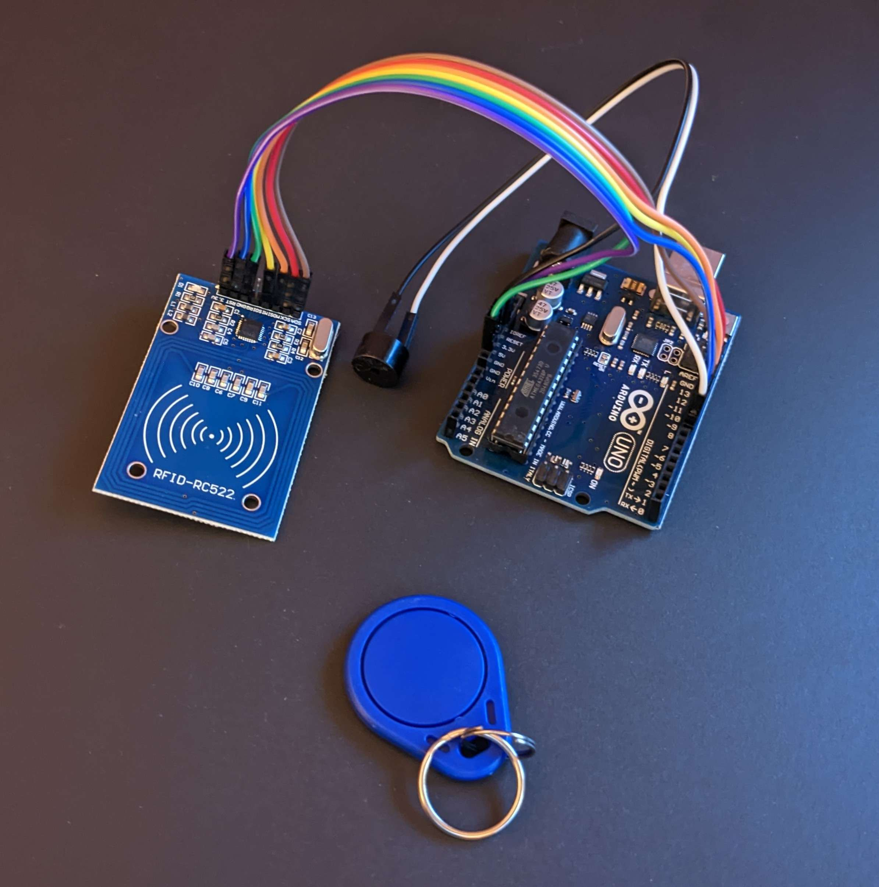
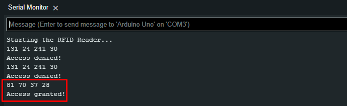
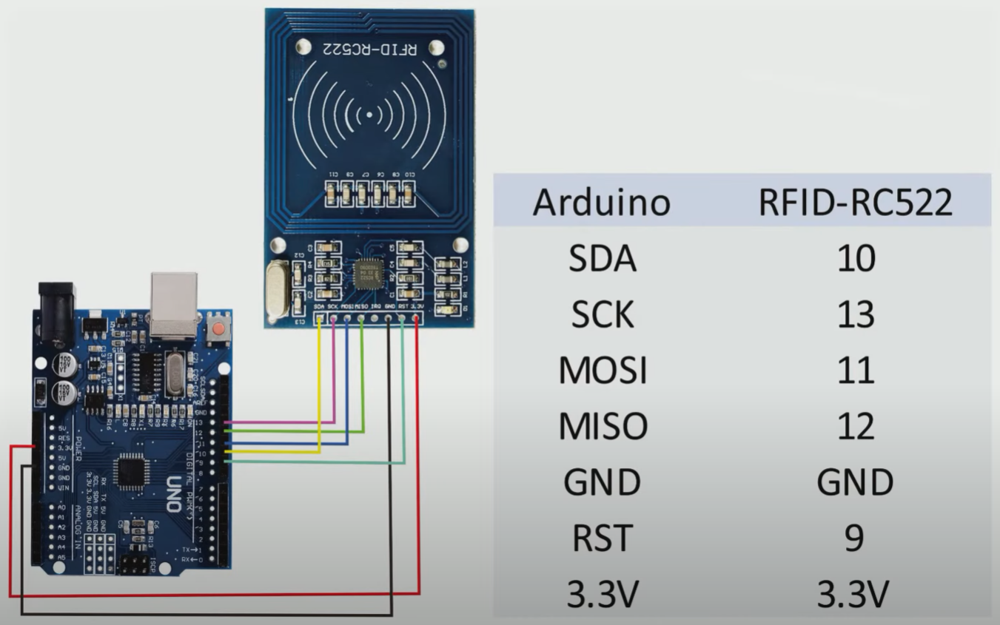

# UNO-RC522 RFID scanner

### Simpel opsætning med Arduino Uno R3 og RFID scan modulet RC522.  

 Scanner og tjekker om det definerede RFID nummer er korrekt, hvis et andet indtastes, meldes der "Access Denied!".

 Der er tilføjet en Active Buzzer som giver lyd baseret på adgang: 

### Til projektet er der brugt følgende:
* 1 active buzzer
* 9 kabler
* 1 Arduino UNO R3 board
* 1 RFID-RC522 board
* 1+ RFID chips til indlæsning

 <b>Kabelføring (inden tilføjelse af active buzzer):</b> 

